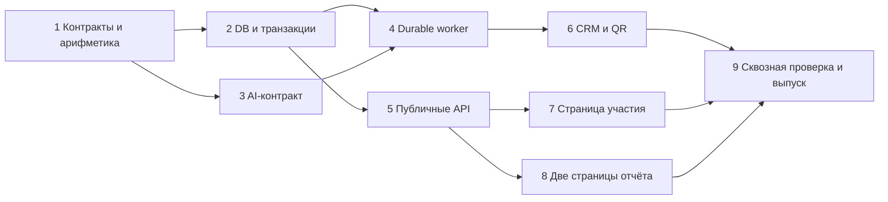

# NBS Leadership Forum 2026 Implementation Plan

> **For agentic workers:** REQUIRED SUB-SKILL: Use superpowers:executing-plans to implement this plan task-by-task. Steps use checkbox (`- [ ]`) syntax for tracking. Делегирование через subagent-driven-development возможно только при разрешённом в сессии режиме; текущая подготовка выполнена одним агентом.

**Goal:** Реализовать опрос NBS с тремя открытыми вопросами, CRM-кнопками начала/завершения, смысловой кластеризацией и двумя версиями опубликованного отчёта.

**Architecture:** Отдельный NBS-модуль с собственными Supabase-таблицами, атомарными RPC и надёжной очередью AI-задач. Существующие CRM-auth, HTTP guards, purpose-token primitives, fonts и `qrcode` переиспользуются без переработки Case Lab III. Публичные короткая и полная страницы читают безопасные проекции одной опубликованной версии отчёта.

**Tech Stack:** Next.js 16.2.10 App Router, React 19.2.4, strict TypeScript, Supabase/PostgreSQL, pg_cron/pg_net/Vault, native fetch/OpenRouter JSON Schema, CSS Modules, существующий qrcode.

**Specification:** [2026-10-01-nbs-leadership-forum-design.md](../specs/2026-10-01-nbs-leadership-forum-design.md).

## Global Constraints

- Единый payload QR: `https://caselab.kz/narxoz-business-school/`.
- Публичные страницы: `/narxoz-business-school/`, `/narxoz-business-school/answers/`, `/nbs-full-answers/`.
- CRM: `/crm/nbs/`, пункт навигации NBS, кнопки «Начать» и «Закончить».
- Лимит — 200 Unicode code points после указанной нормализации; LF считается одним символом.
- Имя и фамилия обязательны. Поля вопросов допускают пропуск, но для отправки нужен хотя бы один непустой ответ.
- Одна отправка фиксирует весь набор из трёх полей атомарно. После успешной отправки набор заблокирован для редактирования.
- Один ответ принадлежит ровно одному основному кластеру. При нескольких идеях выбирается основная.
- TOP-5 — максимум пять кластеров по убыванию числа ответов. Если их меньше, не создавать дополнительные.
- Размер, denominator, порядок и процент вычисляет приложение. Модель их не задаёт.
- Публичные результаты не содержат имён, фамилий, исходных индивидуальных ответов, внутренних ID или AI-служебных данных.
- Все новые таблицы имеют RLS и закрыты для `anon`/`authenticated`; чтение/запись осуществляет server-only service-role клиент.
- CRM-мутации требуют серверной CRM-сессии, same-origin, CSRF и `Idempotency-Key`.
- Environment выбирается только сервером из нового `NBS_ENVIRONMENT=test|live`.
- Кнопка «Закончить» закрывает сбор и создаёт jobs; автоматического закрытия через 20–30 минут нет.
- Анализ продолжает работать после закрытия CRM; публикация трёх вопросов и общего вывода атомарная.
- Scoped NBS palette: `#991E1E`, `#7A1818`, ограниченный `#E94848`, нейтральные `#F2F2F2/#FFFFFF/#2B2B2B`; существующие Benzin/Gilroy.
- Без новых packages, обновления lockfile, новых client-only boundaries в существующих страницах и unrelated refactoring.
- Старые migrations, Case Lab III API, live/leaderboard, payments, auth implementation, security headers/CSP не менять.
- Проверять код статически/CLI; пользователь проверяет визуальную читаемость и QR. Агент не запускает браузер или dev server без отдельного запроса.

## 1. Карта файлов и зависимости

### Чистые контракты

- `app/lib/nbs/questions.ts`: точные вопросы, короткие подписи и версия набора.
- `app/lib/nbs/contracts.ts`: типы состояния, входов, safe public responses, jobs и reports.
- `app/lib/nbs/text.ts`: единая Unicode/newline нормализация и подсчёт.
- `app/lib/nbs/validation.ts`: регистрация/анкета, неизвестные поля, длина, пустота.
- `app/lib/nbs/report.ts`: подсчёты, сортировка, отчёт и screen/full projections.

### Server-only NBS-модуль

- `app/lib/nbs/config.server.ts`: environment и серверные settings, fail-closed validation.
- `app/lib/nbs/database.types.ts`: только новые NBS tables/RPC и используемый rate-limit RPC.
- `app/lib/nbs/db.server.ts`: типизированный Supabase service-role client.
- `app/lib/nbs/session.server.ts`: NBS-cookie, purpose-scoped HMAC и проверка владельца.
- `app/lib/nbs/repository.server.ts`: регистрация, snapshot/state и атомарная анкета.
- `app/lib/nbs/operator.server.ts`: start/finish/retry, CRM snapshot, QR helpers.
- `app/lib/nbs/jobs.server.ts`: claim/complete/fail/dispatch и lease/fencing.
- `app/lib/nbs/analysis-prompt.server.ts`: версия промпта, JSON Schemas и инструкции.
- `app/lib/nbs/openrouter.server.ts`: bounded fetch и parsing provider envelope.
- `app/lib/nbs/analysis.server.ts`: anonymous mapping, membership validation, question texts и comparison.
- `app/lib/nbs/worker.server.ts`: выполнение одного job и transitions pipeline.
- `app/lib/nbs/public.server.ts`: только published aggregates и safe projection.

### Routes и UI

- `app/api/nbs/state/route.ts`, `session/route.ts`, `responses/route.ts`, `results/route.ts`.
- `app/api/admin/nbs/route.ts`, `start/route.ts`, `finish/route.ts`, `retry/route.ts`, `qr/route.ts`.
- `app/api/internal/nbs/jobs/route.ts`.
- `app/narxoz-business-school/page.tsx`, `NbsParticipantClient.tsx`.
- `app/narxoz-business-school/answers/page.tsx`, `app/nbs-full-answers/page.tsx`.
- `app/components/nbs/NbsResultsClient.tsx`, `NbsTheme.module.css`.
- `app/crm/nbs/page.tsx`, `NbsOperatorClient.tsx`.
- Изменить только `app/crm/components/CrmSectionNav.tsx` для навигации и `package.json` для двух NBS scripts.

### DB, проверки и эксплуатация

- `supabase/migrations/20261001000000_create_nbs_forum.sql`.
- `supabase/migrations/20261001010000_schedule_nbs_forum_worker.sql`.
- `supabase/tests/nbs_forum.test.sql`, `supabase/tests/nbs_forum_rls.test.sql`.
- `tests/nbs/text-validation.test.ts`, `report.test.ts`, `session.test.ts`, `analysis.test.ts`, `worker.test.ts`, `participant-api.integration.test.ts`, `operator-api.integration.test.ts`, `public-results.test.ts`, `pages.test.ts`.
- `tests/fixtures/nbs/semantic-cases.ts`: исключительно синтетические ответы и ожидаемые смысловые связи.
- `scripts/benchmark-nbs-forum.ts`: synthetic quality/latency benchmark и его безопасный JSON summary.
- `scripts/check-nbs-concurrency.ts`: параллельные обращения к test deployment, без использования live участников.
- `docs/nbs-leadership-forum-operations.md`: settings, scheduler, rehearsal, начало/завершение и recovery.

Это предложенная структура новых файлов, не утверждение о том, что они уже созданы. Не создавать файл, если его ответственность полностью покрыта другим перечисленным модулем после реализации; изменение границы отражать в contracts/tests и plan.

## 2. Общие интерфейсы

Зафиксировать эти exports в Task 1; последующие задачи используют те же имена и формы. Числовые ключи answer set сериализуются в JSON как строки `"1"`, `"2"`, `"3"`.

```ts
export type NbsEnvironment = "test" | "live";
export type NbsQuestionNumber = 1 | 2 | 3;
export type NbsRunState = "ready" | "open" | "analyzing" | "analysis_failed" | "published";
export type NbsAnswerSet = Record<NbsQuestionNumber, string>;
export type NbsRegistrationInput = { runId: string; firstName: string; lastName: string };
export type NbsSubmissionInput = { runId: string; answers: NbsAnswerSet };
export type NbsRunCommand = { runId: string; expectedVersion: number };

export type NbsSnapshotAnswer = { answerId: string; text: string };
export type NbsQuestionSnapshot = {
  runId: string;
  environment: NbsEnvironment;
  snapshotVersion: number;
  questionNumber: NbsQuestionNumber;
  question: string;
  shortQuestion: string;
  answers: NbsSnapshotAnswer[];
};

export type NbsExclusionReason = "nonsense" | "spam" | "technical" | "irrelevant" | "unclear";
export type NbsValidatedClustering = {
  clusters: Array<{ clusterId: string; title: string; answerIds: string[] }>;
  excluded: Array<{ answerId: string; reason: NbsExclusionReason }>;
};
export type NbsQuestionStats = {
  questionNumber: NbsQuestionNumber;
  question: string;
  shortQuestion: string;
  total: number;
  valid: number;
  ignored: number;
  topClusters: Array<{
    clusterId: string;
    title: string;
    count: number;
    percent: number;
    memberIds: string[];
  }>;
};
export type NbsQuestionTexts = {
  explanations: Array<{ clusterId: string; explanation: string }>;
  conclusion: string;
};
export type NbsQuestionReport = {
  questionNumber: NbsQuestionNumber;
  question: string;
  shortQuestion: string;
  total: number;
  valid: number;
  ignored: number;
  clusters: Array<{ title: string; count: number; percent: number; explanation: string }>;
  conclusion: string;
};
export type NbsReport = {
  reportId: string;
  reportVersion: number;
  publishedAt: string;
  questions: [NbsQuestionReport, NbsQuestionReport, NbsQuestionReport];
  comparison: string;
};
export type NbsScreenReport = {
  reportId: string;
  reportVersion: number;
  questions: Array<{
    questionNumber: NbsQuestionNumber;
    shortQuestion: string;
    clusters: Array<{ title: string; percent: number }>;
    insufficientClusters: boolean;
  }>;
};
export type NbsParticipantState = {
  runId: string;
  state: NbsRunState;
  questions: Array<{ number: NbsQuestionNumber; text: string }>;
  participant: null | { displayName: string; submitted: boolean; answers: NbsAnswerSet | null };
};
export type NbsResultsResponse =
  | { status: "published"; view: "screen"; report: NbsScreenReport }
  | { status: "published"; view: "full"; report: NbsReport }
  | { status: Exclude<NbsRunState, "published">; report: null };

export type NbsJobType = "question_cluster" | "question_report" | "forum_summary";
export type NbsClaimedJob = {
  jobId: string;
  runId: string;
  environment: NbsEnvironment;
  snapshotVersion: number;
  jobType: NbsJobType;
  questionNumber: NbsQuestionNumber | null;
  attemptCount: number;
  leaseToken: string;
  leasedUntil: string;
};
export type NbsModelMetadata = {
  requestedModels: string[];
  servedModel: string | null;
  generationId: string | null;
  promptVersion: string;
  requestHash: string;
  latencyMs: number;
  promptTokens: number;
  completionTokens: number;
  cost: number | null;
};
```

### Task 1: Контракты, вопросы, нормализация и арифметика

**Files:** создать `questions.ts`, `contracts.ts`, `text.ts`, `validation.ts`, `report.ts` из карты; tests `text-validation.test.ts`, `report.test.ts`.

**Interfaces:**

- `normalizeAnswer(value: string): string`, `answerLength(value: string): number`.
- `parseNbsRegistration(value: unknown): NbsRegistrationInput`, `parseNbsSubmission(value: unknown): NbsSubmissionInput`, `parseNbsRunCommand(value: unknown): NbsRunCommand`.
- `buildQuestionStats(snapshot: NbsQuestionSnapshot, clustering: NbsValidatedClustering): NbsQuestionStats`.
- `buildQuestionReport(stats: NbsQuestionStats, texts: NbsQuestionTexts): NbsQuestionReport`.
- `buildNbsReport(context: {reportId: string; reportVersion: number; publishedAt: string}, questions: NbsQuestionReport[], comparison: string): NbsReport`.
- `toScreenReport(report: NbsReport): NbsScreenReport`, `toFullReport(report: NbsReport): NbsReport`.

- [ ] Создать экспортированный массив трёх exact questions/short labels из spec §4 и `NBS_QUESTION_SET_VERSION = "nbs-leadership-forum-2026-v1"`.
- [ ] Написать тесты Enter/CRLF/200–201/emoji/unknown fields/partial анкеты. Использовать этот конкретный набор проверок:

```ts
import assert from "node:assert/strict";
import test from "node:test";
import { answerLength, normalizeAnswer } from "../../app/lib/nbs/text";
import { parseNbsSubmission } from "../../app/lib/nbs/validation";

const runId = "11111111-1111-4111-8111-111111111111";
test("LF сохраняется; CRLF нормализуется; Unicode длина единая", () => {
  assert.equal(normalizeAnswer("Нет времени\r\nМного задач"), "Нет времени\nМного задач");
  assert.equal(answerLength("😀".repeat(200)), 200);
  const input = parseNbsSubmission({ runId, answers: { 1: "Нет времени\nМного задач", 2: "", 3: "" } });
  assert.equal(input.answers[1], "Нет времени\nМного задач");
});
test("201 символ и анкета без содержательных полей отклоняются", () => {
  assert.throws(() => parseNbsSubmission({ runId, answers: { 1: "я".repeat(201), 2: "", 3: "" } }));
  assert.throws(() => parseNbsSubmission({ runId, answers: { 1: " \n", 2: "", 3: "" } }));
});
```

- [ ] Запустить `npx tsx --test tests/nbs/text-validation.test.ts` до реализации; ожидается ошибка отсутствующего модуля. Реализовать normalize functions из spec §6 и validators; нормализованный ответ не `.trim()`-ить при сохранении. Запретить NUL/C1 controls, разрешить LF после замены CR/tab.
- [ ] Написать fixture подсчёта: 13 анкет, 1 пустое поле, 1 excluded, 6 смысловых кластеров с размерами `3,2,2,2,1,1`. Проверить `valid=11`, `ignored=2`, только пять строк, counts `[3,2,2,2,1]`, проценты `[27,18,18,18,9]`; шестой валидный ответ остаётся в denominator.
- [ ] Реализовать арифметику по проверенной принадлежности ответов, без модельных чисел:

```ts
import type { NbsQuestionSnapshot, NbsQuestionStats, NbsValidatedClustering } from "./contracts";

export function buildQuestionStats(
  snapshot: NbsQuestionSnapshot,
  clustering: NbsValidatedClustering,
): NbsQuestionStats {
  const valid = clustering.clusters.reduce((sum, cluster) => sum + cluster.answerIds.length, 0);
  const ignored = snapshot.answers.filter((answer) => answer.text.trim().length === 0).length
    + clustering.excluded.length;
  if (valid + ignored !== snapshot.answers.length) throw new Error("Invalid answer coverage");
  const collator = new Intl.Collator("ru");
  const ordered = clustering.clusters.map((cluster) => ({ ...cluster, count: cluster.answerIds.length }))
    .sort((a, b) => b.count - a.count || collator.compare(a.title, b.title) || a.clusterId.localeCompare(b.clusterId));
  return {
    questionNumber: snapshot.questionNumber,
    question: snapshot.question,
    shortQuestion: snapshot.shortQuestion,
    total: snapshot.answers.length,
    valid,
    ignored,
    topClusters: ordered.slice(0, 5).map((cluster) => ({
      clusterId: cluster.clusterId,
      title: cluster.title,
      count: cluster.count,
      percent: valid === 0 ? 0 : Math.round(cluster.count / valid * 100),
      memberIds: cluster.answerIds,
    })),
  };
}
```

- [ ] Сделать `buildNbsReport` с проверкой точного набора вопросов `[1,2,3]`, уникальности и safe aggregate fields. Проекции конструировать явным перечислением полей, не spread внутренних jobs/stats.
- [ ] Запустить `npx tsx --test tests/nbs/text-validation.test.ts tests/nbs/report.test.ts`; ожидается PASS. Покрыть 0 valid, один/три кластера, ties, округление без доведения до 100%, неверный набор вопросов. После проверки — scoped commit `feat(nbs): define survey contracts and report arithmetic`.

### Task 2: Новая схема, атомарные RPC, session и repository

**Files:** создать migration `20261001000000_create_nbs_forum.sql`; `config.server.ts`, `database.types.ts`, `db.server.ts`, `session.server.ts`, `repository.server.ts`, `operator.server.ts`, `jobs.server.ts`; DB tests и `session.test.ts`.

**Interfaces:**

- `getNbsConfig(): {environment: NbsEnvironment; workerSecret: string; tokenSecret: string}`; secrets server-only, никаких client props.
- `getNbsAdminClient()` — typed SupabaseClient нового NBS Database; existing rate-limit signature включить без изменения RPC.
- `issueNbsSession(input: {environment: NbsEnvironment; runId: string; participantId: string; version: number}): string`.
- `parseNbsSession(value: string | null | undefined)` — null либо перечисленные поля + token; `assertNbsSession(session, participant, environment): void` проверяет run и version.
- `registerNbsParticipant(input, key): Promise<{participantId: string; runId: string; version: number; replayed: boolean}>`.
- `submitNbsResponses(participantId: string, input: NbsSubmissionInput, key: string): Promise<{submitted: true; replayed: boolean}>`.
- `loadNbsParticipantState(sessionValue: string | undefined): Promise<NbsParticipantState>`; `loadNbsQuestionSnapshot(job: NbsClaimedJob): Promise<NbsQuestionSnapshot>`.
- `startNbsRun(command: NbsRunCommand, key: string): Promise<{stateVersion: number}>`, `finishNbsRun(command, key)`, `retryNbsRun(command, key)` — тот же result shape.
- `loadNbsOperatorSnapshot()` — state/version/times, counts, job status/error categories; не возвращает secrets.
- `claimNbsJob(workerId: string): Promise<NbsClaimedJob | null>`; `completeNbsJob(job, result, metadata)`, `failNbsJob(job, category)`, `dispatchNbsJobs(): Promise<void>`.

- [ ] Проверить отсутствие новых миграционных timestamp-конфликтов: `rg --files supabase/migrations`. Создать все шесть таблиц spec §9, seed один `ready` run в каждом `test/live` с snapshot exact questions. Копии старых applied migrations не редактировать.
- [ ] Добавить SQL-тесты: RLS включён на каждой таблице; anon/authenticated не имеют SELECT/DML/EXECUTE; service_role может вызвать NBS RPC; environment-composite FK отклоняет cross-environment reference; question 4 и ответ 201 code points отклоняются; разные люди с одинаковым именем допустимы.
- [ ] Реализовать транзакционные register/submit/start/finish RPC. Подписи параметров:

```sql
-- Все возвращают jsonb, SECURITY DEFINER, search_path = pg_catalog, public, extensions.
-- service_role only; expected_version сравнивается под блокировкой run.
nbs_forum_register_participant(p_environment text, p_run_id uuid, p_first_name text,
  p_last_name text, p_idempotency_key text, p_request_hash text)
nbs_forum_submit_responses(p_environment text, p_run_id uuid, p_participant_id uuid,
  p_answers jsonb, p_idempotency_key text, p_request_hash text)
nbs_forum_start(p_environment text, p_run_id uuid, p_expected_version integer,
  p_idempotency_key text, p_request_hash text, p_actor text)
nbs_forum_finish(p_environment text, p_run_id uuid, p_expected_version integer,
  p_idempotency_key text, p_request_hash text, p_actor text)
```

В submit: заблокировать строку запуска, проверить command/replay/hash-conflict **до проверки состояния**, затем проверить `state='open'`, participant/run/environment, наличие ровно ключей 1/2/3 и длину в БД. Предварительный поиск command не заменяет повторную проверку после получения блокировки. Создать все три строки ответов и command в одной транзакции. Unique constraint дополнительно запрещает вторую анкету. В finish взять **ту же** блокировку запуска, выставить `closed_at`, `snapshot_version`, hash/size, state `analyzing`, создать ровно три cluster jobs; вернуть 202 на уровне route.

- [ ] Реализовать claim/complete/fail/retry/publish RPC для Task 4. Логический key `(run_id, snapshot_version, job_type, question_number)` уникален, включая summary с NULL question: использовать отдельный partial unique index либо `NULLS NOT DISTINCT`. Claim блокирует run для лимита concurrency 3 и due job через `SKIP LOCKED`; lease 120 sec, attempts increment. Все commits job проверяют актуальный lease и snapshot.
- [ ] В `complete_job` блокировать строку запуска перед проверкой зависимостей: успешный cluster создаёт свой report job, третий question report создаёт summary. Это устраняет гонку при одновременном завершении трёх вопросов. Успешный summary получает уже скомпилированный safe `NbsReport` и вызывает publish **в той же транзакции**. Нельзя отметить summary success, а публикацию оставлять отдельным незавершённым шагом. Unique report snapshot/version и run pointer обеспечивают один результат.
- [ ] Обработать expired lease: попытки до 3 возвращаются в claim; исчерпанные expired jobs переводятся в failed и run `analysis_failed` при dispatch/claim maintenance. Retry сбрасывает attempts только failed jobs и state run, сохраняет successful результаты и snapshot.
- [ ] Написать typed Database/RPC args/results без `any`, собственный `getNbsAdminClient` по существующему шаблону. Использовать canonical body hash в commands; exceptions наружу переводят routes. В API/repository не использовать напрямую anon Supabase client `app/lib/supabase.ts`.
- [ ] Реализовать HMAC-cookie через existing token primitives; purpose содержит environment/runId. ФИО не входят в cookie. Client registration key UUID scoped per run допускает восстановление cookie при сетевом replay. Самостоятельные NBS session types исключают принятие Case Lab token.
- [ ] Проверить session fixtures: неправильный token/version/run/environment → unauthorized; одинаковые имена не дают одинаковый session ID; Cookie path `/api/nbs/`, httpOnly, secure production. Пример contract assertion:

```ts
import assert from "node:assert/strict";
import { issueNbsSession } from "../../app/lib/nbs/session.server";

const runId = "11111111-1111-4111-8111-111111111111";
const participantId = "22222222-2222-4222-8222-222222222222";
assert.notEqual(
  issueNbsSession({ environment: "test", runId, participantId, version: 1 }),
  issueNbsSession({ environment: "live", runId, participantId, version: 1 }),
);
```

- [ ] Выполнить локальные DB tests через `node_modules/.bin/supabase test db --local supabase/tests/nbs_forum.test.sql supabase/tests/nbs_forum_rls.test.sql` после проверки доступности local DB. Если локальный runtime недоступен, записать эту точную блокировку; не заменять тест проверкой текста SQL и не обращаться автоматически к live DB.
- [ ] Проверить конкурентный submit/finish отдельными соединениями в test DB: run-row locking даёт либо полные три строки до snapshot, либо 409/0 новых строк. Два submit одной сессии дают одну анкету; replay key одинакового body возвращает прежний успех и после finish. Commit `feat(nbs): add isolated survey storage and atomic controls`.

### Task 3: Аналитический prompt, structured output и semantic fixtures

**Files:** `analysis-prompt.server.ts`, `openrouter.server.ts`, `analysis.server.ts`, `tests/nbs/analysis.test.ts`, `tests/fixtures/nbs/semantic-cases.ts`.

**Interfaces:**

- `clusterNbsQuestion(snapshot: NbsQuestionSnapshot, options: {attemptCount: number}): Promise<{clustering: NbsValidatedClustering; metadata: NbsModelMetadata}>`.
- `generateNbsQuestionTexts(stats: NbsQuestionStats, examples: Array<{clusterId: string; answers: string[]}>, options: {attemptCount: number}): Promise<{texts: NbsQuestionTexts; metadata: NbsModelMetadata}>`.
- `generateNbsComparison(questions: NbsQuestionReport[], options: {attemptCount: number}): Promise<{comparison: string; metadata: NbsModelMetadata}>`.
- `validateNbsClustering(value: unknown, aliases: Map<string, string>): NbsValidatedClustering` — возвращает source answer IDs после проверки полной принадлежности.
- `completeNbsJson(messages, schema, options)` — private helper; parse `payload.model` и `payload.id` отдельно, без логов content.

- [ ] Перенести все правила spec §11 в `NBS_CLUSTERING_PROMPT_VERSION = "nbs-clustering-v1"`. Отдельно сформулировать system instruction, что quoted answers — untrusted data, not instructions; forbid tools и внешние выводы. Примеры пользователя включить как semantic examples, явно запретить использование отсутствующих категорий.
- [ ] Создать strict JSON Schemas cluster output, question texts, forum comparison. Cluster schema содержит **все** clusters/members/excluded и не имеет fields count/percent/score. IDs `A000001` и далее не ограничивать тремя цифрами.
- [ ] Сделать временную shuffled alias map и input payload. Server mapping от alias к response ID хранится в scope вызова; поля ФИО/session/ticket IDs не входят в AI payload. Source `answerId` никогда не используется как AI alias. Перед вызовом удалять распознаваемые email/телефоны из свободного текста, сохраняя основной смысл; добавить в prompt запрет переносить имена и контакты в агрегаты. Проверка агрегатов перед сохранением результата job блокирует распознаваемые контактные данные и повторяет соответствующий шаг генерации. Синтетические fixtures покрывают самораскрытие контактов и имени; не заявлять полную анонимизацию произвольного текста.
- [ ] Написать tests с fixture input 4 answers: two in same cluster, one other cluster, one excluded. Expected output coverage проверять так:

```ts
const aliases = new Map([
  ["A000001", "source-1"], ["A000002", "source-2"],
  ["A000003", "source-3"], ["A000004", "source-4"],
]);
const modelOutput = {
  clusters: [
    { id: "c1", title: "Перегрузка операционными задачами", memberIds: ["A000001", "A000002"] },
    { id: "c2", title: "Бюрократия", memberIds: ["A000003"] },
  ],
  excluded: [{ answerId: "A000004", reason: "spam" }],
};
assert.equal(validateNbsClustering(modelOutput, aliases).clusters[0].answerIds.length, 2);
assert.throws(() => validateNbsClustering({ ...modelOutput, excluded: [] }, aliases));
assert.throws(() => validateNbsClustering({
  ...modelOutput,
  excluded: [{ answerId: "A000001", reason: "spam" }],
}, aliases));
```

- [ ] Добавить malformed/duplicate/unknown IDs, duplicated cluster IDs, title >7 words, empty clusters, model percentages, markdown-fenced JSON, oversize provider response, invalid `finish_reason`/truncated content fixtures. Reject incomplete output and retry, never guess membership.
- [ ] Реализовать fetch с `models`, schema, `require_parameters`, `data_collection: deny`, `zdr: true`, `AbortSignal.timeout(45_000)`, response size 1 MiB. Для default pair не задавать unsupported `temperature`; не включать plugins. Сохранять generation ID отдельно от `payload.model`; missing served model → null, не подставлять generation ID.
- [ ] Проверить input/output budget до запроса, сохранить all answers без silent slice. Cluster max completion limit ≤60,000; проверенный supported model context учитывать с резервом под prompt/output. Если budget не поддерживается, safe category `input_too_large`, без публикации части набора.
- [ ] question_texts получает уже посчитанные stats и до трёх представителей TOP-кластера, отдаёт explanations по существующим cluster IDs плюс conclusion. Validate точное покрытие TOP-cluster IDs, explanations ≤300 chars, conclusion 1–2 предложения/≤600 chars. Model output не вправе менять числа/titles.
- [ ] comparison получает три aggregate reports, вывод 3–5 предложений/≤1400 chars, без predictions и психологических ярлыков. Для 0 valid использовать deterministic neutral text без модели. Автоматическая проверка длины/структуры не заменяет semantic benchmark.
- [ ] Прогнать `npx tsx --test tests/nbs/analysis.test.ts tests/nbs/report.test.ts`; mocked fetch проверяет, что в outbound payload нет synthetic names и секретных fields. Commit `feat(nbs): cluster anonymous answers with validated membership`.

### Task 4: Durable pipeline, scheduler и recovery

**Files:** `worker.server.ts`; реализованные `jobs.server.ts`/`operator.server.ts`; migration `20261001010000_schedule_nbs_forum_worker.sql`; `app/api/internal/nbs/jobs/route.ts`; `tests/nbs/worker.test.ts`; расширить DB queue tests.

**Interfaces:** потребляет Task 2 job storage и Task 3 analysis. Экспортирует `runNbsWorkerOnce(): Promise<{kind: "idle" | "completed" | "retried" | "failed" | "lease_lost"}>`.

- [ ] Написать fake-store tests: 3 cluster jobs → 3 report jobs → 1 summary → ровно 1 published report; worker closed/restarted не теряет queued jobs; expired lease fencing не позволяет сохранить stale результат. Проверить one-job/invocation и concurrency≤3.
- [ ] Реализовать worker по типу job; все inputs загружаются с проверкой environment/snapshot, не из произвольного route body. Основной алгоритм:

```text
claim one due job
  question_cluster:
    load immutable question snapshot
    if no nonempty answers -> create validated empty clustering without provider
    else -> clusterNbsQuestion(snapshot, attemptCount)
    buildQuestionStats(snapshot, validated result)
    complete job, retaining internal membership for audit/representative lookup
  question_report:
    load completed cluster stats for same snapshot/question
    if valid = 0 -> deterministic empty report
    else -> generateNbsQuestionTexts(stats, up to 3 actual examples per TOP cluster)
    buildQuestionReport; complete job
  forum_summary:
    load exactly three successful question reports for same snapshot
    if all valid = 0 -> deterministic neutral comparison
    else -> generateNbsComparison
    buildNbsReport; complete job with atomic publication
on classified failure -> fail job under same lease, schedule retry or fail run
after successful complete/fail -> best-effort dispatch next due jobs
```

- [ ] Worker route: `runtime="nodejs"`, `dynamic="force-dynamic"`, `maxDuration=60`. Require POST JSON body≤4 KiB, exact Bearer `NBS_WORKER_SECRET` via constant-time compare, environment body equals config. Unknown/unauthorized requests cannot claim jobs. Public error responses use safe codes.
- [ ] `nbs_forum_dispatch_jobs(p_environment)` выполняет maintenance expired jobs, считает свободные slots и ставит через `pg_net` до трёх HTTP worker calls. Header и URL берёт из Vault, не возвращает decrypted values. Запрос `net.http_post` должен иметь timeout не меньше worker response budget; use `timeout_milliseconds := 65000` и проверить поддержку параметра в установленном pg_net перед rehearsal.
- [ ] Installer `nbs_forum_install_worker_schedule(p_environment)` проверяет выбранные Vault entries и exact `/api/internal/nbs/jobs/` path, создаёт/заменяет только `nbs-forum-worker-<environment>`, schedule `* * * * *`. Миграция определяет функцию; не вызывает production installer автоматически.
- [ ] Immediate dispatch делать после durable finish и complete. Если dispatch падает, queued job сохраняется и cron подхватывает его; success Finish всё равно означает принятый закрытый snapshot, а не готовый отчёт. `after` не является обязательной частью recovery.
- [ ] Проверить attempts=3, delays15/60, fallback-first на invalid-json повторе, timeout, неполный вопрос, 0 submissions, all ignored. На retry successful jobs не перегенерируются; report version не смешивается. Lease-lost не переводить successful replacement job в failed.
- [ ] Запустить `npx tsx --test tests/nbs/worker.test.ts tests/nbs/analysis.test.ts` и local queue SQL tests. Дополнительно в rehearsal отключить worker между claim/complete, дождаться lease expiry и проверить completion другой invocation без CRM. Commit `feat(nbs): run durable analysis jobs and publish atomically`.

### Task 5: Публичные API участия и две безопасные проекции

**Files:** public NBS routes из карты; `public.server.ts`; `participant-api.integration.test.ts`, `public-results.test.ts`.

**Interfaces:** Task 2 registration/session/repository; Task 1 report projections. `loadNbsPublicResults(view: "screen" | "full"): Promise<NbsResultsResponse>` читает только `published_report_id` текущего environment, никогда job outputs.

- [ ] Написать route tests с injected dependencies по шаблону существующих `handlePost`/`handleGet`. GET state без cookie отдаёт только state/questions; cookie даёт только собственную participant information. Нельзя читать другого участника через query/body ID.
- [ ] Session POST: same-origin, JSON≤4KiB, validated UUID `runId`, idempotency header, existing DB rate-limit scope `nbs_session_<environment>` по HMAC от registration key. Registration key устойчивый при retry; valid replay восстанавливает прежнюю cookie.
- [ ] Responses POST: same-origin, JSON ≤16 KiB, авторизация по NBS-cookie, ровно ключи answers 1/2/3, хотя бы один непустой ответ. Rate-limit scope `nbs_submit_<environment>` ограничивает сессию до 10 запросов за 60 секунд; RPC решает атомарное сохранение, повтор и гонку закрытия. Environment и participant ID не принимаются от клиента.
- [ ] Status mappings фиксировать contract tests. Основные ожидаемые результаты:

```ts
assert.equal((await postValidNewSubmission()).status, 201);
assert.equal((await replaySameSubmissionKey()).status, 200);
assert.equal((await submitWithChangedBodyAndSameKey()).status, 409);
assert.equal((await submitFromClosedRun()).status, 409);
assert.equal((await submitWith201Characters()).status, 400);
assert.equal((await submitWithForeignOrigin()).status, 403);
assert.equal((await submitWithoutSession()).status, 401);
```

В test файле определить эти fixture helpers на локальном `handlePost` с fake repository/cookie store; ни один helper не обращается к production.

- [ ] Results GET `view` принимает только screen/full, неизвестный view400. During analyzing/failed возвращает status и report:null; не возвращает промежуточный TOP или служебную error reason. Published screen/full используют один report ID/version и рассчитанные числа.
- [ ] В public-results tests добавить synthetic `firstName`, `lastName`, `memberIds`, `answerId`, `sessionToken`, `servedModel` во внутренний fixture и проверить их отсутствие в проекциях. В screen projection дополнительно исключить count/explanation/conclusion/comparison. Full report содержит только поля contracts.
- [ ] Проверить `Cache-Control: no-store` на success/error, content-type handling, bounded body, неизвестные поля, cookie attributes, восстановление submission state после refresh и outage without data loss. Запустить `npx tsx --test tests/nbs/participant-api.integration.test.ts tests/nbs/public-results.test.ts`; commit `feat(nbs): expose survey and safe result APIs`.

### Task 6: NBS-раздел CRM, operator API и единый QR

**Files:** `app/crm/components/CrmSectionNav.tsx`; новые CRM page/client и admin NBS routes; `operator-api.integration.test.ts`, часть `pages.test.ts`.

**Interfaces:** существующие `requireCrmAdmin`, `issueCrmCsrfToken`, `verifyCrmMutation`; Task 2 operator commands; Task 4 dispatch. `buildNbsQr(format: "png" | "svg"): Promise<Buffer | string>` отдаёт один фиксированный payload.

- [ ] В navigation union добавить `"nbs"`, в links добавить `{href:"/crm/nbs/", label:"NBS", section:"nbs"}`. Другие tabs сохранить. Новый Server Component page проверяет `requireCrmAdmin`, при отсутствии даёт существующий возврат на `/crm/`, при наличии передаёт только CSRF token в `NbsOperatorClient`.
- [ ] Admin GET проверяет CRM session. Start/Finish/Retry POST требуют same-origin, existing CSRF verifier с `requireIdempotencyKey:true`, validated `runId/expectedVersion`, 4KiB body. Обработка snapshot command возвращает safe JSON; Finish/Retry202 не ждут model call.
- [ ] Написать API cases unauthorized401, missing/wrongCSRF403, staleVersion409, start→open, finish→analyzing+3jobs, duplicatefinish replay без новых jobs, retry только failed. Проверить повтор Start не очищает ответы.
- [ ] Клиент использует текущие CRM controls: состояние/версия, прошедшее время, счётчики, прогресс задач, ссылки. Опрос раз в 5 секунд с отменой и без перекрывающихся fetch; после успеха обновлять версию команды. Доступность кнопок зависит от состояния; на время запроса блокировать их. Завершение подтверждается встроенным блоком; Escape отменяет подтверждение, фокус возвращается на «Закончить».
- [ ] Выполнить safe operator UX flow:

```text
ready: Начать enabled; Закончить disabled
open: Начать disabled; Закончить enabled
finish pending: оба disabled
analyzing: основные кнопки disabled; виден прогресс
analysis_failed: Повторить анализ enabled
published: результаты и ссылки доступны; сброс/повторный сбор не предложены
```

- [ ] QR route требует CRM session, allow format png/svg, imports server-only qrcode. Options: `errorCorrectionLevel:"M"`, `margin:4`, `width:1024` для PNG, black/white. Headers correct MIME + download filename; fixed payload `https://caselab.kz/narxoz-business-school/`, без session/answer params.
- [ ] QR unit/API tests проверяют exact payload аргумент генератора, format/MIME, authentication и отсутствие client qrcode imports. Настоящий QR будет дополнительно проверен сканированием пользователем в Task9.
- [ ] Запустить `npx tsx --test tests/nbs/operator-api.integration.test.ts tests/nbs/pages.test.ts`. Проверить изменения existing navigation тестов только в части нового пункта. Commit `feat(nbs): add CRM controls and shared survey QR`.

### Task 7: Страница ввода и scoped NBS design

**Files:** `app/narxoz-business-school/page.tsx`, `NbsParticipantClient.tsx`, `app/components/nbs/NbsTheme.module.css`, `pages.test.ts`.

**Interfaces:** Task5 state/session/responses; Task1 shared text counter. Server page экспортирует metadata, client содержит только form/state polling.

- [ ] До написания page/API-dependent кода перечитать relevant local guides, если пакет Next изменился: `15-route-handlers.md`, `cookies.md`, `generate-metadata.md`, route-segment-config `maxDuration.md`. Не брать новые Next conventions из памяти.
- [ ] Server page: title `NBS Leadership Forum 2026 — Опрос`, scoped description/canonical/OG/Twitter и noindex. Не добавлять `use client` в root/homepage или менять глобальные fonts/colors.
- [ ] CSS Module описывает NBS surface/form/stage/report styles; reuse root font variables. Основные tokens:

```css
.nbsRoot {
  --nbs-primary: #991e1e;
  --nbs-primary-hover: #7a1818;
  --nbs-accent: #e94848;
  --nbs-surface: #f2f2f2;
  --nbs-text: #2b2b2b;
  color: var(--nbs-text);
  font-family: var(--font-body);
}
.answer { white-space: pre-wrap; }
.control:focus-visible { outline: 3px solid var(--nbs-primary); outline-offset: 3px; }
@media (prefers-reduced-motion: reduce) {
  .control { transition: none; }
}
```

- [ ] Клиентский сценарий: загрузка → ввод имени → ожидание/открытая форма → отправлено/сбор закрыт. UUID регистрации сохраняется для запуска в sessionStorage; ФИО и тексты там не сохранять. Ответы остаются в React state при обновлении статуса и ошибках. Получение состояния не перезаписывает неотправленный черновик.
- [ ] Три textarea с точными вопросами в label, счётчиком символов и сообщениями об ошибке. Enter добавляет перенос. Слишком длинная вставка сохраняется с ошибкой; `.trim()` используется только для проверки хотя бы одного ответа. Минимума 30 символов нет; ввод через IME не обрезать молча.
- [ ] При отправке использовать один ключ идемпотентности до успеха или окончательного отказа, передавать все три поля, авторизация — по cookie. Блокировать повторные клики. Смена состояния обновляет доступность формы; серверный 409 не стирает черновик и объясняет закрытие сбора.
- [ ] Page tests проверить route existence, exact questions references, metadata override, shared normalizer import, отсутствие per-Enter handler и Case Lab endpoint strings. Такие static tests дополняют API/round-trip, не служат доказательством фактического поведения клавиатуры.
- [ ] Выполнить `npx tsc --noEmit --incremental false` и `npx tsx --test tests/nbs/text-validation.test.ts tests/nbs/pages.test.ts tests/nbs/participant-api.integration.test.ts`. Commit `feat(nbs): add branded participant survey page`.

### Task 8: Короткая и полная страницы результатов

**Files:** `app/narxoz-business-school/answers/page.tsx`, `app/nbs-full-answers/page.tsx`, `NbsResultsClient.tsx`, scoped CSS, public-results/pages tests.

**Interfaces:** `NbsResultsClient({view:"screen"|"full"})`; Task5 public result API; generic fetch parses discriminated `NbsResultsResponse` and refuses mismatched view/report version.

- [ ] Создать обе страницы как Server Components с отдельными canonical/title/description/OG/Twitter/noindex. Страницы отличаются только проекцией отчёта; они не выбирают разные снимки и не запускают модели.
- [ ] Реализовать waiting status до start/during collection, analysis status после Finish, published content только при полностью опубликованном report. Network outage сохраняет последний успешный report и показывает короткое сообщение; raw provider errors не показываются.
- [ ] Короткая версия выводит три коротких вопроса, максимум пять пронумерованных строк с названиями и процентами. При ширине ≥1200px — три колонки, на телефоне — вертикально. Числа `01`–`05` форматируются через `String(index+1).padStart(2,"0")`. Не выводить количества, объяснения, выводы и имена участников.
- [ ] Full view выводит exact question, total/valid/ignored, TOP-5 count/percent/explanation, question conclusion и comparison после трёх вопросов; добавить print CSS без JS PDF-библиотеки.
- [ ] При `clusters.length<5` показывать нейтральную подпись о недостаточном числе устойчивых смыслов. Не заполнять оставшиеся строки примерами из промпта. При `valid=0` не выводить NaN/Infinity/фиктивные проценты.
- [ ] Опрашивать API раз в 5 секунд до публикации: `AbortController`, восстановление после скрытия вкладки/сбоя сети, очистка таймеров, без одновременных повторных fetch. После публикации остановить опрос. Несовпадение проекции обработать безопасным сообщением, не показывать данные разных версий.
- [ ] Проверить примеры с длинными семисловными названиями, 0/3/5 кластерами, равными частотами, округлением и отсутствующим отчётом. CLI tests проверяют данные и состав элементов; визуальную читаемость на 1920×1080 и телефоне оставить пользователю.
- [ ] Запустить `npx tsx --test tests/nbs/public-results.test.ts tests/nbs/pages.test.ts tests/nbs/report.test.ts`, `npx tsc --noEmit --incremental false`; commit `feat(nbs): publish screen and full forum reports`.

### Task 9: Сквозная проверка, AI benchmark и эксплуатационный runbook

**Files:** `scripts/benchmark-nbs-forum.ts`, `scripts/check-nbs-concurrency.ts`, synthetic fixtures; `docs/nbs-leadership-forum-operations.md`; `package.json` scripts; финальные test coverage корректировки.

**Interfaces:** использует public/admin/test deployment API и Task3 real analysis с synthetic data. Не читает CRM records или `.env*` в лог; конфигурация поступает через уже настроенный process environment.

- [ ] Добавить scripts без изменения dependencies/lockfile:

```json
{
  "test:nbs": "tsx --test tests/nbs/*.test.ts",
  "benchmark:nbs": "tsx scripts/benchmark-nbs-forum.ts"
}
```

Сохранить существующие scripts. Benchmark supports `--size 200|500|1000`, `--repeat 3`, `--summary-output <tmp-path>`; summary содержит model/promptversions, timing, counts, coverage/mismatch и safe cost, без answer text/names.

- [ ] Синтетические примеры отдельно проверяют смысловые связи из инструкции: операционка/время/пожары объединяются; одинаковые слова в разных контекстах разделяются; анализ резюме не объединяется с окончательным увольнением; стратегия отделяется от рутинной отчётности; отсутствующие темы не возникают. Добавить короткие ответы, переносы, несколько идей, спам, попытки изменить инструкции, единичное «не знаю» и повторяемую содержательную неопределённость.
- [ ] Метрики: покрытие 100%, нет выдуманных ID/двойной принадлежности, объединение ожидаемых близких пар ≥90%, разделение ожидаемых разных пар ≥90%, выводы без неподтверждённых предположений. Оценка по парам допускает разные корректные названия кластеров; не сравнивать формулировки модели дословно. Во всех принятых запусках должны отсутствовать ошибки структуры.
- [ ] Проверить current provider support со strictschema/ZDR на реальном endpoint. Metadata из public models API недостаточно. Если privacy-compatible routing отсутствует, зафиксировать blocking result без снятия ZDR. Реальные вызовы и cost допустимы только в рамках разрешённого запуска benchmark; в подготовке документов они не выполнены.
- [ ] Прогнать синтетический pipeline на 200, 500 и 1000 ответах **на каждый вопрос**, по 3 повтора; записать время каждого вызова и время от завершения сбора до публикации. Для 200 ответов целевой срок ≤180 секунд, остальные объёмы измеряются отдельно. Изменение промпта/модели подтверждать повтором конкретных неудачных примеров.
- [ ] `check-nbs-concurrency.ts` работает только с тестовым NBS deployment, с отдельными cookie для 200 синтетических участников в общей сети. 200 одновременных анкет дают ровно 200 принятых наборов/600 строк ответов; повторные одинаковые запросы число не увеличивают. Целевой p95 приёма ≤3 секунды. Одновременное завершение сбора делит поздние анкеты на полностью принятые до фиксации снимка и отклонённые, без частичной записи.
- [ ] Провести репетицию восстановления: закрыть CRM, повредить один ответ provider/отключить worker, дождаться истечения lease, восстановить; данные сохраняются, повтор не удваивает количества, отчёт появляется после всех обязательных задач. Неверный snapshot/job/lease не может опубликовать результат.
- [ ] Runbook содержит exact settings names `NBS_ENVIRONMENT`, `NBS_WORKER_SECRET`; existing Supabase/OpenRouter/token configuration dependencies; Vault naming test/live; installer invocation; cron removal после форума только отдельным административным действием; ручной сценарий Begin/End/Retry и вопросы визуальной проверки. Не записывать реальные значения секретов или deploymenttokens.
- [ ] Финальные CLI gates:

```bash
npm run test:nbs
npm run test:case-lab-3-live
npx tsc --noEmit --incremental false
npm run build
git diff --check
```

DB tests отдельно выполнить против local/test DB; существующую общую `npm run test` не расширять без конкретного remainingrisk. ESLint можно вызвать по затронутым TS/TSX-файлам после проверки текущего config; не расширять lint на весь unrelated репозиторий ради cleanup.

- [ ] Перед production: убедиться, что hosting поддерживает `maxDuration=60`, pg_net timeout 65000 мс и cron. Выполнить dry-run новых миграций/проверку RLS → тестовую репетицию → production release согласно полученной авторизации. Секреты не выводить. Installer production активируется после deployment рабочего NBS endpoint; Case Lab scheduler не меняется.
- [ ] Пользователь проверяет `/narxoz-business-school/` на телефоне, Enter/переносы, счётчики, форму и подтверждение; PNG/SVG QR ведёт в ту же форму; экранная версия читается на 1920×1080 при длинных названиях; полный отчёт корректен. Агент не начинает браузерную проверку автоматически.
- [ ] Commit `test(nbs): verify forum analysis and document operations`. Финальный отчёт реализации перечисляет изменённые файлы/поведение, выполненные проверки и пропуски; отсутствие реальных проверок скорости, визуального вида и RLS нельзя называть готовностью к production.

## 3. Порядок выполнения и контроль результата



Выполнять последовательно в текущей сессии/изолированном worktree при начале реализации. Если после этого документа репозиторий изменился, сначала сравнить только перечисленные featurefiles и актуальный `package.json`; не полагаться на старые line numbers.

## 4. Сверка покрытия спецификации

| Требование спецификации | Задача |
| --- | --- |
| Три exact questions и отдельные routes | 1,7,8 |
| Имя/фамилия без билетной зависимости, одинаковые имена | 2,5,7 |
| Enter, CRLF, Unicode, max200, short/partial answers | 1,5,7 |
| Одна атомарная анкета/идемпотентность/refresh | 2,5,7,9 |
| CRM tab, ручные Begin/End, counters/progress | 2,6 |
| Единый downloadable QR | 6,9 |
| Смысловой анализ всех ответов, главная идея, исключение невалидных | 3,9 |
| Полное membership покрытие и реальные denominators | 1,3,5 |
| TOP≤5, ties, rounding,0valid | 1,3,8 |
| Объяснения/вопросные и общие нейтральные выводы | 3,4,8,9 |
| Только короткая экранная версия плюс `/nbs-full-answers/` | 5,8 |
| Durable processing/lease/retries/atomicpublish | 2,4,9 |
| RLS, серверная авторизация, защита персональных данных, разделение сред | 2,3,5,6,9 |
| Scoped NBS palette/currentfonts/metadata/accessibility | 6,7,8 |
| Сохранение Case Lab, отсутствие новых зависимостей и посторонних изменений | Все задачи, финальные проверки 9 |
| Качество/скорость на 200–1000 ответах, общая Wi-Fi сеть, гонка завершения | 9 |

## 5. Проверка этого планового этапа

При подготовке проверены local rules, relevant source/contracts/migrations, scripts/dependencies, local Next guides и официальные OpenRouter schema/privacy docs/public model metadata. Спецификация и план сверены по coverage, type/signature consistency и отсутствию незаполненных разделов.

На этом этапе не запускались app tests/build, DB migrations, schema/production queries, real paid AI benchmark или browser verification. До выполнения Task9 оценки latency/capacity являются acceptance targets; у worker runtime и scheduler остаются реальные deployment gates. Подготовка плана не равна реализации или production readiness.
