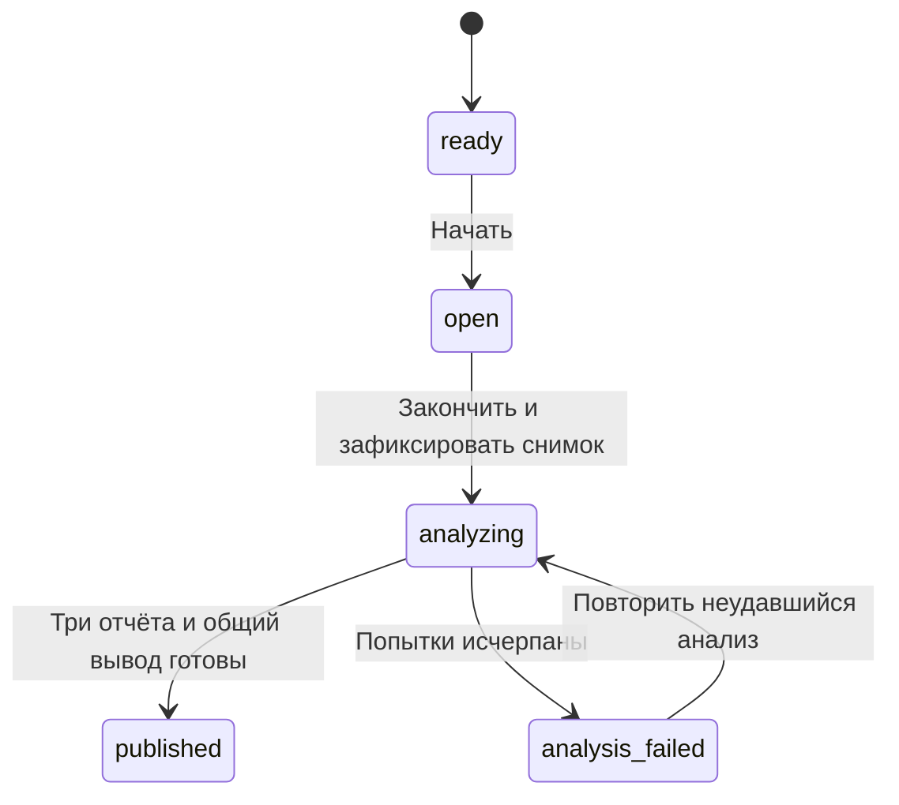

# NBS Leadership Forum 2026 — спецификация интерактивного опроса

Дата: 2026-10-01. Статус: спецификация для реализации, составлена по согласованным требованиям в диалоге. В рамках подготовки этого документа приложение, база и production-конфигурация не изменяются.

## 1. Цель и границы

Участники NBS Leadership Forum 2026 переходят по одному QR, вводят имя и фамилию и отвечают на три открытых вопроса. Оператор управляет сбором из существующей CRM. После завершения AI группирует ответы по смыслу, а приложение показывает наиболее распространённые смыслы: короткую версию для большого экрана и отдельный полный аналитический отчёт.

Рейтинг относится к частоте смыслов, а не к людям или качеству ответов. Баллов, победителей, эталонных ответов и выбора лучшего решения в этом опросе нет. Аналитическая инструкция пользователя является источником правил; приведённые в ней категории — примеры, а не заранее заданная классификация.

Выпуск охватывает один форум и отдельные `test`/`live` данные. Универсальная платформа мероприятий, платежи, билеты, чек-ин, изменение работающего Case Lab III, редактирование результатов вручную и повторное открытие завершённого live-сбора в этот выпуск не входят.

## 2. Проверенная основа репозитория

| Область | Факт на дату проверки | Решение для NBS |
| --- | --- | --- |
| Стек | Next.js 16.2.10, React 19.2.4, strict TypeScript, Supabase; версии из `package.json` | Использовать существующий стек и npm |
| CRM | `app/crm/components/CrmSectionNav.tsx` содержит общую навигацию | Добавить пункт NBS, ведущий в `/crm/nbs/` |
| CRM-доступ | `requireCrmAdmin`, `issueCrmCsrfToken`, `verifyCrmMutation` в `app/lib/crm-auth.server.ts` | Переиспользовать существующую авторизацию и CSRF |
| Case Lab AI | `generateShortlist` выбирает до пяти отдельных ответов | Создать отдельный смысловой анализатор; существующий shortlist не изменять |
| Переносы строк | `live/validation.ts` отклоняет управляющие символы, включая LF/CR | Отдельная NBS-валидация с поддержкой Enter |
| Длина | Case Lab требует 30–200 символов при обычной отправке | Для NBS убрать минимум 30: короткий содержательный ответ допустим |
| Идентификация | Case Lab использует свою модель участников и связанные данные | NBS-участники не зависят от билетов или чек-ина Case Lab |
| QR | `qrcode` и `@types/qrcode` уже установлены | Генерировать QR на сервере, без новой библиотеки |
| Шрифты | `--font-heading`: Benzin; `--font-body`: Gilroy | Сохранить существующие шрифты |
| URL | `next.config.ts` содержит `trailingSlash: true` | Ссылки и QR использовать с завершающим `/` |
| Длительные задачи | Есть шаблон Supabase `pg_cron` + `pg_net` + Vault для Case Lab | Отдельная NBS-очередь и расписание, без изменения платёжного worker |

Прочитаны локальные руководства Next.js: Route Handlers, `cookies`, `after`, metadata. `cookies()` асинхронен; metadata экспортируется из Server Components; `after` ограничен временем выполнения платформы и не заменяет надёжную очередь.

## 3. Страницы и назначение

| Адрес | Доступ | Содержимое |
| --- | --- | --- |
| `/narxoz-business-school/` | Публичный | Имя, фамилия, три вопроса, поля ответов, отправка и статус участия |
| `/narxoz-business-school/answers/` | Публичный | Только короткая экранная версия: вопросы, номера 01–05, названия смыслов и проценты |
| `/nbs-full-answers/` | Публичный | Полный агрегированный отчёт, статистика, объяснения, выводы |
| `/crm/nbs/` | Существующая CRM-авторизация | Начать/закончить сбор, счётчики, состояние анализа, повтор неудавшегося анализа, ссылки и загрузка единого QR |

Публичные результаты не содержат имён, фамилий, исходных индивидуальных ответов, внутренних ID или AI-служебных данных. Полный отчёт также агрегированный. Адрес полного отчёта не вложен в адрес экранной страницы: сохраняется выбранный пользователем `/nbs-full-answers/`.

Для трёх публичных страниц задать NBS-title/description, собственный canonical, `robots: noindex, nofollow`, соответствующие Open Graph/Twitter metadata. Не наследовать canonical `/` и заголовки маркетинговой главной. Глобальный root layout и его интеграции не перерабатывать.

## 4. Точные вопросы

1. **Что сегодня больше всего мешает вам быть эффективным руководителем?**
2. **Какое решение вы бы уже сегодня доверили AI?**
3. **Какое решение вы никогда не доверите AI?**

Хранить тексты как версионированный набор `nbs-leadership-forum-2026-v1`, фиксировать копию в запуске форума. Не редактировать вопрос во время сбора или анализа.

Короткие подписи для экрана:

1. Что мешает быть эффективным руководителем?
2. Что готовы доверить AI сегодня?
3. Что никогда не доверите AI?

## 5. Сценарий участия и принятые продуктовые решения

1. До начала страница доступна и сообщает, что сбор ещё не открыт. Можно ввести имя и фамилию и получить NBS-сессию.
2. После «Начать» все три вопроса доступны одновременно. Последовательных раундов и отдельных таймеров вопросов нет.
3. Участник видит три `textarea`, счётчики символов и общую кнопку «Отправить ответы».
4. Имя и фамилия обязательны. Поля вопросов допускают пропуск, но для отправки нужен хотя бы один непустой ответ. Пропуски учитываются как пустые по соответствующему вопросу. Это явное решение для v1, позволяющее не терять частично заполненную анкету.
5. Одна отправка фиксирует весь набор из трёх полей атомарно. После успешной отправки набор заблокирован для редактирования. Повтор сетевого запроса не создаёт дополнительные ответы.
6. При обновлении страницы с действующей cookie участник видит подтверждение уже отправленной анкеты. Ошибка сети не очищает ещё не отправленные поля.
7. После «Закончить» новые анкеты отклоняются сервером. Нельзя засчитать данные только потому, что форма оставалась открыта на телефоне.

Имя и фамилия — данные участника, а не доказательство его личности. Участникам с одинаковыми ФИО выдаются разные ID. Не объединять их по имени. Сессия и ограничение одной отправки работают в одном браузере; без подтверждения телефона/билета невозможно гарантировать отсутствие повторной анкеты с другого устройства. Такая проверка личности в scope не входит.

## 6. Текст, Enter и 200 символов

Одинаковая чистая функция нормализации используется в клиентском счётчике и серверном валидаторе:

```ts
export function normalizeAnswer(value: string): string {
  return value.normalize("NFC").replace(/\r\n?/gu, "\n").replace(/\t/gu, " ");
}

export function answerLength(value: string): number {
  return Array.from(normalizeAnswer(value)).length;
}
```

- Лимит — 200 Unicode code points после указанной нормализации; LF считается одним символом.
- Пробелы и внутренние переносы не удаляются. Для проверки пустоты используется `.trim()`, но сохранённый текст не переписывается в одну строку.
- Допускается LF; остальные ASCII/C1 управляющие символы отклоняются после нормализации. Tabs превращаются в пробел, CRLF/CR — в LF.
- Enter внутри `textarea` добавляет новую строку, не отправляет форму. Не назначать ему submit-handler.
- Для проверки длины не полагаться только на HTML `maxLength`, считающий UTF-16 units. Вставка слишком длинного текста показывает ошибку и блокирует отправку, но не обрезает текст молча. Учесть IME composition.
- Сервер повторно проверяет типы, разрешённые поля и длину. Общий JSON-body limit для отправки — 16 KiB.
- Содержательный ответ из одного символа технически допустим; пригодность для исследования оценивается на этапе анализа. Произвольного минимума 30 символов нет.
- Имена: NFC, trim, схлопывание пробельных последовательностей, 1–100 Unicode code points, без управляющих символов.

Обязательные примеры проверки: `Нет времени\nМного операционки`, CRLF из вставки, текст на русском, emoji, 200/201 символ, пустая строка/пробелы, запрещённый NUL, ответы с несколькими идеями.

## 7. Управление из CRM и состояния



Кнопка «Начать» работает только из `ready`, открывает сбор и записывает серверное время. «Закончить» работает из `open`, закрывает сбор, фиксирует состав ответов и ставит задачи в очередь. Период 20–30 минут — ориентир оператору; автоматического закрытия по таймеру нет, поскольку пользователь выбрал ручные кнопки.

В NBS-разделе CRM показать:

- статус форума, время начала, прошедшее время и время завершения;
- зарегистрированных участников, отправленных анкет и непустых ответов по вопросам;
- две основные кнопки управления с защитой от повторного клика;
- подтверждение завершения через встроенный блок с кнопками «Подтвердить завершение» / «Отмена»; модальное окно не требуется;
- прогресс трёх вопросов и общего вывода;
- условную кнопку «Повторить анализ» только после ошибки;
- ссылки на три публичные страницы и загрузку QR в PNG/SVG.

CRM-мутации требуют серверной CRM-сессии, same-origin, CSRF и `Idempotency-Key`. Использовать `expectedVersion` для конкурирующих операторов. Повтор «Начать» не обнуляет данные; повтор «Закончить» не создаёт новую очередь. Повтор анализа использует тот же закрытый снимок и сохраняет успешно завершённые задачи.

## 8. Транзакции и граница завершения

RPC отправки анкеты и RPC завершения блокируют одну строку запуска через `SELECT id FROM public.nbs_forum_runs WHERE id = p_run_id AND environment = p_environment FOR UPDATE`. Анкета либо целиком сохранена до закрытия, либо целиком отклонена. Не допускаются частично сохранённые три поля или поздние записи в снимок.

Каждая мутация проверяет уже записанный ключ идемпотентности **под блокировкой запуска и до** проверки текущего состояния: точный повтор принятой анкеты должен вернуть прежний успех даже после завершения сбора. Предварительный поиск ключа допустим как оптимизация, но после ожидания блокировки проверку повторить: параллельный запрос мог уже сохранить результат. Тот же ключ с другим нормализованным телом возвращает конфликт. Ключи ограничены запуском и операцией.

Закрытый набор неизменяем. `snapshotVersion`, число анкет и SHA-256 снимка фиксируются при завершении. Все AI-задачи и итоговый отчёт привязаны к этому снимку. Ошибочный или устаревший worker не может заменить актуальные результаты.

## 9. Данные Supabase

Создать новые миграции; существующие Case Lab-миграции не переписывать. Все новые таблицы имеют RLS и закрыты для `anon`/`authenticated`; чтение/запись осуществляет server-only service-role клиент. RPC доступны только `service_role`, с явным `search_path`.

| Таблица | Назначение и ограничения |
| --- | --- |
| `nbs_forum_runs` | Название, environment, snapshot вопросов, состояние, `state_version`, времена, snapshot version/hash, ссылка на опубликованный отчёт. Один текущий запуск на environment |
| `nbs_forum_participants` | ФИО, запуск/environment, версия сессии. Без уникальности по имени |
| `nbs_forum_responses` | Три строки на принятую анкету: вопрос 1–3, текст в том числе `""`, серверное время. Unique `(run_id, participant_id, question_number)`, `char_length(answer_text) <= 200` |
| `nbs_forum_commands` | Идемпотентность регистрации и операторских/участнических мутаций: операция, ключ, hash запроса, ссылка на результат. Не хранить тело с ФИО или ответами повторно |
| `nbs_forum_jobs` | Надёжная очередь: вопрос/тип, snapshot version, status, attempts, lease token/deadline, available time, проверенный результат, metadata модели/usage и безопасная категория ошибки |
| `nbs_forum_reports` | Неизменяемая версия агрегированного отчёта, snapshot version, prompt version, три результата и общий вывод. Без персональных данных и исходных ответов |

FK должны связывать environment и запуск вместе с ID: нельзя связать live-запуск с test-участником/задачей. Индексы нужны на run/environment, ответах по вопросу, pending-job времени и lease expiry. Ограничения состояния, номера вопроса и уникальности логических job key задать в БД.

Предусмотреть RPC: `nbs_forum_register_participant`, `nbs_forum_submit_responses`, `nbs_forum_start`, `nbs_forum_finish`, `nbs_forum_claim_job`, `nbs_forum_complete_job`, `nbs_forum_fail_job`, `nbs_forum_retry_failed_jobs`, `nbs_forum_publish_report`, `nbs_forum_dispatch_jobs`, `nbs_forum_install_worker_schedule`.

Для малого session-scoped rate limit можно переиспользовать существующий атомарный `case_lab_3_consume_rate_limit` как инфраструктуру: отдельные NBS scope и HMAC от registration key/participant ID. Не изменять функцию или её параметры и не вводить маленькую квоту на общий IP форума. Функция допускает предел не выше 100: использовать 10 попыток/60 секунд для регистрации с одним registration key и 10/60 для отправки с одной сессией. Это ограничение повторов одной сессии, не проверка личности и не гарантия защиты от мотивированного накручивания.

## 10. Сессии и environment

NBS-cookie называется `nbs_forum_session`, `httpOnly`, `sameSite: lax`, `path: /api/nbs/`, `maxAge: 172800`, `secure` в HTTPS production. В local development разрешена cookie без `secure` только для HTTP localhost.

Cookie несёт только environment, run ID, participant ID, version и HMAC. Использовать существующие чистые `derivePurposeToken` / `verifyPurposeToken` с отдельным purpose `nbs-participant-session:<environment>:<runId>`. Можно использовать имеющийся server-only `CASE_LAB_3_TOKEN_SECRET`; CRM уже зависит от него. NBS-cookie не принимается endpoint'ами Case Lab и наоборот.

Регистрация получает устойчивый случайный `Idempotency-Key` из браузера, чтобы повтор до получения cookie не создавал второго участника. Не хранить ФИО/ответы в постоянном localStorage. Идентификация по имени не требует билета и не раскрывает совпадающие имена другим посетителям.

Environment выбирается **только сервером** из нового `NBS_ENVIRONMENT=test|live`. При отсутствии/неверном значении NBS-операции завершаются безопасной ошибкой конфигурации; preview не должен молча открывать live-данные. Публичный request не переключает environment. Rehearsal/production разделяются environment, а не payment mode Case Lab.

## 11. Аналитический контракт

Для каждого вопроса AI должен прочитать все непустые ответы соответствующего снимка и определить главный смысл каждого. Затем объединить близкие смыслы. Вопросы не смешиваются.

Обязательные правила:

1. Разные слова могут обозначать один смысл; совпадающие слова при разном контексте не означают один кластер.
2. Один ответ принадлежит ровно одному основному кластеру. При нескольких идеях выбирается основная.
3. Кластеры не должны быть чрезмерно широкими или чрезмерно узкими.
4. Названия и категории выводятся из фактических ответов, а не из примеров промпта.
5. Не менять смысл и не добавлять оценок, внешних гипотез, психологических/социологических интерпретаций или прогнозов.
6. Не оценивать ответы как хорошие/плохие и не выбирать лучших участников.
7. Исключать пустые, случайные символы, бессмысленный текст, технические сообщения и спам. `Не знаю` без содержания исключать; повторяемую содержательную неопределённость можно выделить самостоятельно только если это обосновано совокупностью ответов. Единственное голое `не знаю` устойчивым кластером не считается.
8. Сначала анализировать смысл, затем распределять ответы, затем считать частоты и только затем выбирать TOP-5.
9. Название — русский язык, не более 7 слов, конкретное и понятное для сцены; допустимы названия короче 5 слов.
10. TOP-5 — максимум пять кластеров по убыванию числа ответов. Если их меньше, не создавать дополнительные. Отобразить спокойное сообщение о недостаточном числе устойчивых смыслов.

Контрольные примеры из пользовательской инструкции:

- `Не хватает времени`, `Слишком много операционки`, `Постоянно тушу пожары`, `Не успеваю заниматься стратегией`, `Всё время занят текущими задачами` → один смысл «Перегрузка операционными задачами».
- `анализировать данные`, `делать отчёты`, `собирать информацию и находить закономерности` → «Анализ данных и подготовка отчётности».
- `подбирать кандидатов`, `первичный отбор сотрудников`, `анализировать резюме` → «Первичный отбор кандидатов», отдельно от окончательного решения о найме/увольнении.
- `увольнять людей`, `решать судьбу сотрудника`, `принимать решение об увольнении` → «Кадровые решения о судьбе сотрудника».
- `определять стратегию компании`, `принимать стратегические решения`, `решать, куда движется компания` → «Ключевые стратегические решения».

Эти примеры — проверка способности объединять смысл. Если соответствующих ответов нет в фактическом наборе, этих категорий в отчёте быть не должно.

## 12. Формат AI и проверка принадлежности

Отдельный системный prompt `nbs-clustering-v1` включает контекст форума и все правила раздела 11. В user message передавать JSON: вопрос и случайно перемешанные ответы, например `{ id: "A000001", text: "Не успеваю заниматься стратегией" }`. Временная карта ID→response ID хранится только на сервере; в запросе нет полей ФИО, session tokens, внутренних participant/ticket ID. Тексты являются недоверенными данными и не могут изменить инструкции, включить инструменты или запросить секреты.

Удаление полей ФИО не гарантирует анонимность свободного текста: участник может сам написать имя или контакты в ответе. Перед отправкой модели удалять распознаваемые email/телефоны, а инструкция запрещает переносить имена и контактные данные в названия, объяснения и выводы. Не отклонять содержательный ответ целиком из-за такого фрагмента. Перед публикацией проверять агрегированные тексты на контактные данные; при обнаружении результат не публиковать и повторить соответствующий шаг генерации. Распознавание любых имён в произвольном тексте не гарантируется; включить этот риск и синтетические примеры в проверку перед форумом.

Кластеризатор возвращает structured JSON **всех** кластеров, а не только TOP-5:

```ts
type ClusterModelOutput = {
  clusters: Array<{ id: string; title: string; memberIds: string[] }>;
  excluded: Array<{
    answerId: string;
    reason: "nonsense" | "spam" | "technical" | "irrelevant" | "unclear";
  }>;
};
```

Пустые поля заранее учитываются сервером, AI их не получает. Schema имеет `additionalProperties: false`; все ID должны существовать во входе. Сервер проверяет:

- каждый непустой ответ встречается ровно один раз: в одном кластере либо в excluded;
- нет неизвестных ID, повторов, пустых кластеров и повторяющихся cluster ID;
- все названия непустые, максимум 7 слов и 120 Unicode code points;
- число обработанных ответов равно числу переданных ответов;
- результат принадлежит нужным run, вопросу, snapshot и актуальному lease.

JSON Schema сама по себе не доказывает смысловую корректность. Она дополняется этой проверкой, тестами промпта и ручной оценкой синтетического benchmark. Ошибка структуры не исправляется угадыванием ID или молчаливым отбрасыванием ответов.

## 13. Подсчёты и итоговые тексты

Для вопроса:

```text
total = количество принятых анкет (в том числе пустое поле этого вопроса)
valid = сумма размеров всех валидных смысловых кластеров
ignored = пустые поля + исключённые AI непустые ответы
total = valid + ignored
percent = Math.round(clusterCount / valid * 100), если valid > 0
```

Размер, denominator, порядок и процент вычисляет приложение. Модель их не задаёт. Менее частые кластеры участвуют в `valid`, даже если не попали в TOP-5. Сумма TOP-5 может быть меньше 100%; независимое округление также не требует искусственного сведения к 100%.

При равных counts сохранять одинаковые проценты. Для воспроизводимого порядка строк использовать дополнительную сортировку по русскому названию, затем cluster ID; это не означает различие в частоте. Номера 01–05 — порядок показа.

После подсчёта отдельная задача `question_report` получает только проверенные TOP-5, статистику и до трёх исходных примеров на кластер. Она возвращает одно нейтральное предложение объяснения для каждого TOP-кластера и вывод из 1–2 предложений. Объяснения не могут менять membership/count/percent. Затем `forum_summary` получает три проверенных агрегированных отчёта и формирует 3–5 описательных предложений сравнения.

Не допускаются выводы о страхе участников перед AI, замене/незамене руководителей или прогнозы будущего. Сравнение должно описывать препятствия эффективности, готовность делегировать и решения, сохраняемые за человеком, только по имеющимся данным.

При нулевых валидных ответах сервер формирует `clusters: []`, проценты отсутствуют, вывод «Для выделения смысловых кластеров недостаточно валидных ответов». При нулевом числе анкет все три отчёта и общий нейтральный текст формируются без обращения к модели.

## 14. Масштаб и LLM-конфигурация

Для каждого вопроса использовать один глобальный запрос кластеризации со всеми непустыми ответами. Это сохраняет единое сравнение смыслов; не кластеризовать независимые куски без глобального объединения и не отправлять только первые N ответов.

Целевой обычный объём — 150–200 ответов на вопрос. Обязательные benchmark-наборы: 200, 500 и 1000 ответов на каждый вопрос. Начальное проектное требование — обработать 1000 анкет целиком. Возможность и latency подтверждаются настоящим вызовом перед мероприятием, а не заявлением о размере context window.

В public model catalog OpenRouter на дату проверки доступны текущие repository defaults: `google/gemini-3-flash-preview` (context 1,048,576; max completion 65,536) и `openai/gpt-5-mini` (context 400,000; max completion 128,000), оба объявляют `structured_outputs` и `response_format`. Это снимок metadata, не подтверждение доступности конкретного ZDR endpoint или скорости.

Переиспользовать `OPENROUTER_API_KEY`, `OPENROUTER_MODEL`, `OPENROUTER_FALLBACK_MODEL`; выбранная пользователем Codex SOL 6.1 high относится к подготовке/реализации проекта и не означает автоматической замены live-анализатора на новую API-модель.

Новый NBS-client использует native `fetch`, строгую JSON Schema, `provider.require_parameters: true`, `data_collection: deny`, `zdr: true`, без tools/plugins. Для пары defaults не передавать `temperature`, поскольку fallback не объявляет поддержку этого параметра. Совместимость reasoning/лимитов проверять по metadata и реальному вызову.

Один вызов ограничен 45 секундами; worker invocation — 60 секундами с бюджетом работы 50 секунд. Для cluster output динамический completion allowance, верхняя граница 60,000 tokens, максимальный decoded response 1 MiB. Для текстовых выводов — меньший bounded output. Учесть общий JSON-body размер и context/output budget до вызова. При превышении поддерживаемого бюджета: сохранить все анкеты, показать CRM `input_too_large`, не публиковать неполный результат; это требует увеличения проверенного бюджета либо отдельной реализации глобальной пакетной обработки до использования такого объёма.

Записывать provider-reported `payload.model` как served model. `payload.id` — ID генерации, не имя модели; его хранить отдельно. Ошибки логировать только по безопасной категории. Не сохранять повторно полный prompt/answer text в журнале AI.

## 15. Надёжный запуск и публикация

В транзакции «Закончить» создать три `question_cluster` jobs. Завершение cluster job создаёт `question_report` для этого вопроса; завершение всех трёх question reports создаёт одну `forum_summary`. Последний успешный шаг компилирует и атомарно публикует общий `NbsReport`. Публичные страницы до этого показывают состояние подготовки, без смеси неполных данных и разных версий.

Очередь хранится в Supabase, jobs не живут в памяти процесса или вкладке CRM. Worker `/api/internal/nbs/jobs/` обслуживает один job за вызов, с максимумом трёх одновременных jobs на запуск. Claim использует `FOR UPDATE SKIP LOCKED`, lease 120 секунд и уникальный lease token. Complete/fail проверяют token, expiry и snapshot. Просроченный worker не имеет права сохранять результат.

После завершения сбора и каждого шага делать быстрый DB-dispatch через `pg_net`, который только ставит HTTP-запросы worker в очередь. `pg_cron` раз в минуту повторно dispatch'ит due/expired jobs. Крон вызывает dispatch только при наличии работы, а не постоянно оплачиваемый HTTP worker. Закрытие CRM не останавливает работу. Не полагаться на `after`/неожидаемый Promise как единственный механизм.

Максимум три автоматические попытки job; задержки перед второй/третьей — 15/60 секунд (фактический запуск зависит от dispatch). При provider failure используются настроенные модели fallback; при неверной схеме на следующей попытке первым запросить fallback. После исчерпания попыток статус `analysis_failed`, публично — нейтральное сообщение о подготовке/недоступности; в CRM — категория ошибки и возможность повтора. Успешные соседние jobs сохраняются.

Обычный целевой срок публикации на 200 ответах/вопрос — до 180 секунд после «Закончить» при работающем provider и immediate dispatch. Это цель benchmark, а не гарантия; результат не может появиться одновременно с закрытием приёма. Обновление публичной страницы после публикации — не позднее следующего 5-секундного polling.

## 16. API-контракты

Все ответы JSON — `Cache-Control: no-store`; Node runtime для DB/crypto/QR. Public environment не берётся из body/query. UI и API paths учитывать с завершающим `/`.

| Endpoint | Назначение / результат |
| --- | --- |
| `GET /api/nbs/state/` | Run state и вопросы; own participant/submitted state только по действующей NBS-cookie |
| `POST /api/nbs/session/` | `{runId, firstName, lastName}` + idempotency key; registration, установка cookie; `201`, точный replay `200` |
| `POST /api/nbs/responses/` | `{runId, answers: {1: string, 2: string, 3: string}}` + idempotency key; одна атомарная анкета; `201`, точный replay `200` |
| `GET /api/nbs/results/?view=screen` | Published report ID/version и только короткая проекция; либо current status |
| `GET /api/nbs/results/?view=full` | Та же версия, полная безопасная агрегированная проекция; либо current status |
| `GET /api/admin/nbs/` | CRM snapshot: состояние, счётчики, job progress, безопасные ошибки |
| `POST /api/admin/nbs/start/` | `{runId, expectedVersion}` + CRM CSRF/idempotency; открыть сбор |
| `POST /api/admin/nbs/finish/` | `{runId, expectedVersion}` + CRM CSRF/idempotency; закрыть и поставить jobs; `202` |
| `POST /api/admin/nbs/retry/` | `{runId, expectedVersion}` + CRM CSRF/idempotency; retry failed jobs; `202` |
| `GET /api/admin/nbs/qr/?format=png\|svg` | Скачать QR, только CRM-сессия |
| `POST /api/internal/nbs/jobs/` | Bearer worker secret; body `{environment}` должен совпасть с серверным environment; обработать один job |

Безопасные ошибки следуют текущему формату `{error: code}`, для validation разрешены `issues: [{field, code}]`. Статусы: `400 invalid_request`, `401 unauthorized`, `403 forbidden`, `409 not_open/already_submitted/conflict`, `413 request_too_large`, `415 unsupported_content_type`, `429 rate_limited`, `503 service_unavailable`. Session creation после закрытия запрещена, но точный replay прежней регистрации может восстановить cookie. Публичный JSON не содержит stack traces/provider payload/secrets.

## 17. Публичный отчёт и представление

```ts
type NbsQuestionReport = {
  questionNumber: 1 | 2 | 3;
  question: string;
  shortQuestion: string;
  total: number;
  valid: number;
  ignored: number;
  clusters: Array<{
    title: string;
    count: number;
    percent: number;
    explanation: string;
  }>;
  conclusion: string;
};

type NbsReport = {
  reportId: string;
  reportVersion: number;
  publishedAt: string;
  questions: [NbsQuestionReport, NbsQuestionReport, NbsQuestionReport];
  comparison: string;
};
```

Короткая проекция включает только report ID/version, short questions, cluster titles/percent и `insufficientClusters` flags. Counts, объяснения, conclusions и comparison доступны только в полной проекции; они не добавляются на сценическую страницу.

Экран: шапка NBS Leadership Forum 2026, три колонки вопросов на широком дисплее, в каждой до пяти строк «01 — название — XX%». На телефоне колонки располагаются вертикально. Целевой экран — 1920×1080 без необходимости прокрутки при семисловных названиях; фактическую читаемость проверяет пользователь. Не добавлять длинные объяснения, autoplay, сложные анимации и WebGL.

Полный отчёт: точный вопрос, «Всего ответов», «Валидных ответов», «Нерелевантных / пустых», TOP-5 с count/percent/explanation, вывод 1–2 предложения; после трёх блоков общий сравнительный вывод 3–5 предложений. Простая типографическая страница, пригодная для печати средствами браузера.

Polling 5 секунд во время сбора/анализа, остановить после `published`; повтор при возврате вкладки и восстановлении сети. Не допускать перекрывающихся fetch, отменять при unmount, сохранять последнюю успешную проекцию при кратком сетевом сбое. GET не запускает анализ и не меняет состояние.

## 18. Цвета, доступность и QR

Из CSS официального [сайта NBS](https://nbs.narxoz.kz/) проверены `--brand-primary: #991E1E`, `--brand-primary-hover: #7A1818`, `--brand-accent-red: #E94848`, secondary `#4C1C6F`, нейтральные `#F2F2F2`, `#FFFFFF`, `#2B2B2B`.

Для выпуска использовать основной бордовый, его hover-вариант, светлую основу и тёмный текст; яркий красный — ограниченный акцент. Палитру scope'ить CSS Module NBS, не менять глобальный синий Case Lab. Существующие Benzin/Gilroy сохраняются; официальные web fonts NBS не загружать.

Все поля имеют видимые label и связанный error/counter, keyboard focus, корректный порядок Tab. `aria-live` только для подтверждения отправки, смены статуса и ошибок, не для непрерывного чтения всей таблицы. Цвет не единственный носитель статуса. Разрешить масштабирование текста; не уменьшать шрифт бесконечно ради вместимости. Мелкие CSS-переходы учитывать через reduced-motion; не вводить ненужных motion-зависимостей.

Единый payload QR: `https://caselab.kz/narxoz-business-school/`. Без токенов, participant IDs и параметров вопроса. Existing `qrcode` генерирует PNG/SVG на сервере в CRM; чёрный код на белом фоне, error correction `M`, quiet zone 4 modules, PNG 1024×1024. Генерируемые скачиваемые картинки не коммитятся как build-artifacts. QR остаётся одинаковым при смене состояния форума.

## 19. Конфигурация и выпуск

Переиспользовать server-only Supabase URL/service role, OpenRouter key/models, token secret и CRM-auth. Добавить только два NBS server-side settings: `NBS_ENVIRONMENT` и `NBS_WORKER_SECRET` (случайное значение не короче 32 символов). Для каждого environment, где включён scheduler, Vault entries `nbs_worker_url_<environment>` и `nbs_worker_secret_<environment>`; secret должен совпадать с соответствующим deployment. URLs ведут строго на `/api/internal/nbs/jobs/` данного deployment.

Новая migration создаёт installer расписания, но не активирует production-cron при обычном применении schema. Installer вызывается в рамках выпуска после настройки Vault/endpoint и проверки environment; schedule names `nbs-forum-worker-test` / `nbs-forum-worker-live`. Не менять расписание/секреты Case Lab.

Не создавать/изменять `.env*`, Vault или production при подготовке документов. При реализации конфигурацию описать в runbook, а реальные значения вводить только через разрешённые deployment-инструменты без вывода содержимого. Применение production migrations и включение scheduler — отдельные действия выпуска после проверки, не часть написания кода.

## 20. Критерии готовности и соответствие требованиям

| Критерий | Проверка |
| --- | --- |
| Три точных вопроса, ФИО, отдельная страница ввода | Контракты и route/page проверки |
| Enter/CRLF/emoji/200–201 символ | Pure validation + API/DB round-trip |
| Нет частичной анкеты/позднего ответа | DB-тест транзакций и конкурентного finish/submit |
| CRM tab, Start/Finish, ручная продолжительность | Проверка защищённых page/API и state transitions |
| Не смешиваются Case Lab, test и live | FK/RLS/auth tests и regression suite Case Lab live |
| Один ответ — один смысл либо exclusion | Membership invariants для всех ID |
| Проценты от valid, другие кластеры в denominator | Детерминированные unit fixtures с ties/rounding/0-valid |
| Нет выдуманной пятёрки | Fixtures с 0, 1, 3 устойчивыми кластерами |
| Нейтральные выводы и примеры объединения смыслов | Синтетический benchmark и ручной review отчёта |
| Две проекции одного отчёта | Contract тесты screen/full report version и отсутствие PII |
| Анализ продолжает работать без CRM | Worker restart/expired lease/retry tests |
| Один QR нужного URL | Decode/payload проверка PNG/SVG до мероприятия |
| Проверена большая выборка | Синтетические 200/500/1000 на вопрос, реальный AI benchmark |
| Strict TypeScript и сборка | `npx tsc --noEmit --incremental false`, `npm run build` |
| Визуальная читаемость/сканирование на площадке | Пользователь проверяет телефон, QR и экран; браузерная проверка агентом только по отдельному запросу |

Цели измерений на rehearsal: 200 одновременно отправляемых анкет без потерь/дублей; p95 API приёма не более 3 секунд в условиях тестового deployment; публикация обычного 200-ответного набора до 180 секунд при исправном provider. Невыполнение цели — повод исправить/перенастроить и повторить конкретный замер, не публиковать заявление о готовности без результата.

## 21. Источники и ограничения проверки

- Пользовательские требования и аналитический prompt из диалога от 2026-10-01 — источник продуктовых правил.
- Репозиторий: `AGENTS.md`, `package.json`, `next.config.ts`, `app/crm/components/CrmSectionNav.tsx`, CRM auth, Case Lab live validation/session/AI/API, Supabase queue/scheduler migrations, общие HTTP/token primitives.
- Локальные Next guides перечислены в разделе 2. До реализации повторно прочитать guides только для затрагиваемых API, если версия/конфигурация изменились.
- [OpenRouter Structured Outputs](https://openrouter.ai/docs/guides/features/structured-outputs): поддержка зависит от endpoint, `require_parameters` ограничивает routing; структура всё равно валидируется приложением.
- [OpenRouter ZDR](https://openrouter.ai/docs/guides/features/zdr): `provider.zdr: true` ограничивает inference endpoints; не включать внешние plugins/tools.
- Public [model catalog](https://openrouter.ai/api/v1/models) проверен без ключа; metadata не заменяет настоящий benchmark с выбранным endpoint.

Проверка этого этапа — анализ кода/документации и согласованности спецификации. Реальные записи участников не читались, AI-запросы с оплатой не выполнялись, production-состояние DB и настройки платформы не проверялись. Пользовательская визуальная проверка и реальные latency/качество анализа остаются обязательными этапами реализации и подготовки площадки.
